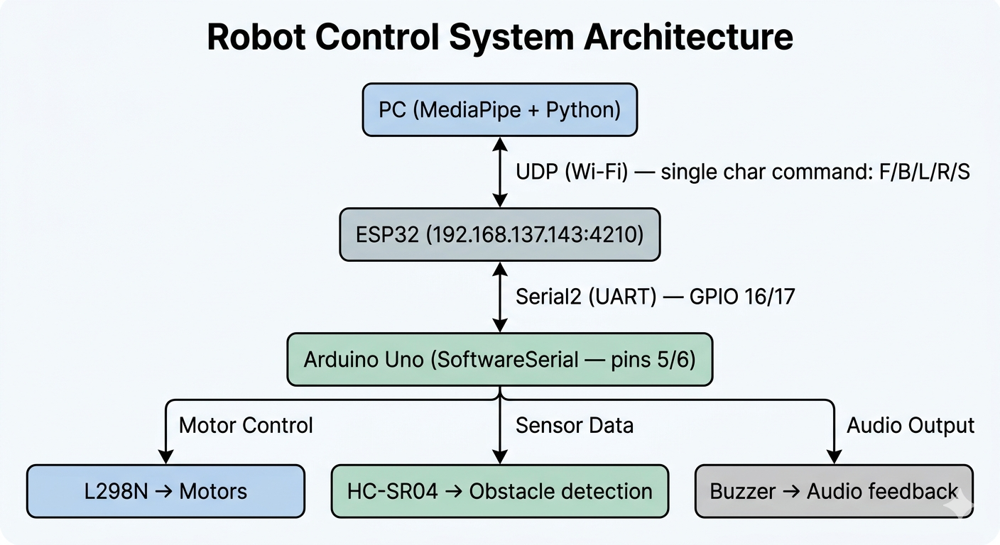

# 🤖 Arduino Robot Car

A 4-wheeled robot car remotely controlled via hand gestures, powered by an Arduino Uno, L298N motor driver, HC-SR04 ultrasonic sensor, and an ESP32 Wi-Fi module. Gesture recognition is handled on a PC using MediaPipe, and commands are sent wirelessly over UDP.

---

## 🎥 Demo

### 🚗 Car Demo
[](https://www.youtube.com/shorts/zA0P0gngUo8)

### 🤚 Hand Gesture Demo
https://github.com/user-attachments/assets/dc24d131-95c1-45b6-982f-e5e591bee00d

## 🧰 Hardware Components

| Component | Details |
|-----------|---------|
| Arduino Uno | Main microcontroller |
| ESP32 | Wi-Fi bridge (UDP → Serial) |
| L298N Motor Driver | Controls 4x DC motors |
| 4x DC Motors | Drive the wheels |
| HC-SR04 Ultrasonic Sensor | Obstacle detection |
| Buzzer | Audio feedback |
| External Battery Pack | Powers motors via L298N |
| USB Cable | Arduino programming & serial monitor |

---

## 🌐 Communication Architecture




## ⚡ Wiring / Connection Description

### L298N → Arduino

| L298N Pin | Arduino Pin | Function |
|-----------|-------------|----------|
| IN1 | 11 | Left Front wheel |
| IN2 | 9 | Left Back wheel |
| IN3 | 10 | Right Front wheel |
| IN4 | 8 | Right Back wheel |
| ENA | 7 | Left side enable |
| ENB | 13 | Right side enable |

### L298N → Motors

| L298N Output | Connected Motor |
|--------------|----------------|
| OUT1, OUT2 | Front Left & Rear Left |
| OUT3, OUT4 | Front Right & Rear Right |

### Ultrasonic Sensor (HC-SR04) → Arduino

| HC-SR04 Pin | Arduino Pin |
|-------------|-------------|
| TRIG | 3 |
| ECHO | 2 |
| VCC | 5V |
| GND | GND |

### Buzzer → Arduino

| Buzzer Pin | Arduino Pin |
|------------|-------------|
| (+) | 4 |
| (−) | GND |

### ESP32 → Arduino (SoftwareSerial)

| ESP32 Pin | Arduino Pin | Notes |
|-----------|-------------|-------|
| TX (GPIO 17) | Pin 5 | ESP32 transmits → Arduino receives |
| RX (GPIO 16) | Pin 6 | Arduino transmits → ESP32 receives |
| GND | GND | Common ground required |

### Power

| Connection | Description |
|------------|-------------|
| Battery (+) → L298N VCC | Powers the motors |
| Battery (−) → L298N GND | Common ground |
| L298N GND → Arduino GND | **Required** — shared common ground |
| USB → Arduino | Programming & Serial Monitor only |

> ⚠️ **Always connect Battery GND and Arduino GND together.** Without a common ground, the motor driver won't receive correct signals from the Arduino.

---

## 💻 Software Setup

### 📁 Project Structure

```
robot-car/
├── virtual_env/
├── arduino_codes/
│   └── arduino_codes.ino       # Main Arduino sketch
├── esp32_wifi_signal/
│   └── esp32_wifi_signal.ino   # ESP32 UDP → Serial bridge
├── hand_detector.py            # MediaPipe gesture detection
├── main.py                     # Main entry point (sends UDP commands)
├── test_udp.py                 # Tests ESP32 UDP connection
└── README.md
```

### Prerequisites

- Python 3.x
- Arduino IDE
- PowerShell (Run as Administrator for execution policy)

### 1. Set PowerShell Execution Policy *(Run as Administrator)*

```powershell
Set-ExecutionPolicy -ExecutionPolicy Unrestricted
```

### 2. Create & Activate Virtual Environment

```bash
py -m venv virtual_env
.\virtual_env\Scripts\activate
```

### 3. Install Python Dependencies

```bash
pip install opencv-python mediapipe requests
```

---

## 🔧 Flashing the Firmware

### ESP32

1. Open `esp32_wifi_signal/esp32_wifi_signal.ino` in Arduino IDE
2. Set your Wi-Fi credentials (see [Security Note](#-security-note) below)
3. Select board: **ESP32 Dev Module**
4. Flash to ESP32

### Arduino

1. Open `arduino_codes/arduino_codes.ino` in Arduino IDE
2. Select board: **Arduino Uno**
3. Flash to Arduino

---

## ▶️ Running the Project

1. Power on the robot (battery connected, Arduino powered via USB or battery)
2. Wait for ESP32 to connect to Wi-Fi (check Serial Monitor at 115200 baud)
3. Verify ESP32 connection:
   ```bash
   python test_udp.py
   ```
4. Start the gesture controller:
   ```bash
   python main.py
   ```

---

## 🎮 Gesture Mapping

| Gesture | Command Sent | Action |
|---------|-------------|--------|
| 👍 Thumbs Up | `F` | Forward |
| 👎 Thumbs Down | `B` | Backward |
| 👈 Point Left | `L` | Spin Left |
| 👉 Point Right | `R` | Spin Right |
| No gesture | `S` | Stop |

### ⚠️ Gesture Recognition Warning

> The hand gesture detection in this project is based on the **relative positions of finger tips** detected by MediaPipe — not on exact hand directions or semantic gestures.
>
> Because of this, the system does **not truly understand** gestures like exact "thumbs up", "left", "right", or "down" directions.
>
> Instead, it classifies the hand pose into one of the predefined categories based on landmark (fingertip) positioning.
> Even a normal open hand like `✋` may still be categorized as one of the four gesture commands depending on the detected finger relationships and hand orientation.
>
> For best results:
> - Keep gestures consistent
> - Use clear hand positioning
> - Maintain stable lighting and camera angle
> - Avoid ambiguous poses that may resemble other patterns

---

## 🛡️ Safety Features

### Obstacle Detection

The HC-SR04 ultrasonic sensor continuously checks for obstacles while moving forward.

- **Stop distance:** 20 cm
- If an obstacle is detected while moving forward, the car **immediately stops** regardless of the gesture command
- The buzzer triggers a **rapid beep pattern** (150ms on / 100ms off) to indicate an obstacle

### Wi-Fi Timeout

If no UDP command is received for **500ms**, the car automatically stops and the buzzer sounds a long alert (1000ms on / 500ms off). This prevents the robot from running away if the connection drops.

### Buzzer Feedback Summary

| Situation | Buzzer Pattern |
|-----------|---------------|
| Obstacle detected | Fast beep (150ms / 100ms) |
| Moving backward | Slow beep (200ms / 400ms) — like a truck |
| Wi-Fi connection lost | Long beep (1000ms / 500ms) |
| Moving forward / turning / stopped | Silent |

---

## 🔒 Security Note

The ESP32 sketch uses a `config.h` file for Wi-Fi credentials that is **not included in this repository**.

Create `esp32_wifi_signal/config.h` with your own credentials:

```cpp
#define WIFI_SSID "your_ssid_here"
#define WIFI_PASSWORD "your_password_here"
```

Then in `esp32_wifi_signal.ino`, they are used as:

```cpp
#include "config.h"

const char* ssid     = WIFI_SSID;
const char* password = WIFI_PASSWORD;
```

> ⚠️ `config.h` is listed in `.gitignore` and will never be committed. Never hardcode or commit your Wi-Fi credentials to a public repository.

The ESP32 also uses a **static IP** configured for a **Windows Mobile Hotspot**. If you're on a different network, update these values in `esp32_wifi_signal.ino`:

```cpp
IPAddress local_IP(192, 168, 137, 143);
IPAddress gateway(192, 168, 137, 1);
IPAddress subnet(255, 255, 255, 0);
```

And update the target IP in `main.py` to match.

---

## 🔌 UDP Command Protocol

Commands are single ASCII characters sent over UDP to the ESP32 at port `4210`.

| Character | Meaning |
|-----------|---------|
| `F` | Forward |
| `B` | Backward |
| `L` | Spin Left |
| `R` | Spin Right |
| `S` | Stop |

You can test commands manually using `test_udp.py` :
---

### Stopping the Arduino (Emergency / Reset)

Flash this sketch to halt all motor output immediately:

```cpp
void setup() {}
void loop() {}
```

---

## 📡 ESP32 Network Config (Quick Reference)

| Parameter | Value |
|-----------|-------|
| Static IP | `192.168.137.143` |
| Gateway | `192.168.137.1` |
| Subnet | `255.255.255.0` |
| UDP Port | `4210` |
| Serial2 Baud | `9600` |
| Serial Monitor Baud | `115200` |
